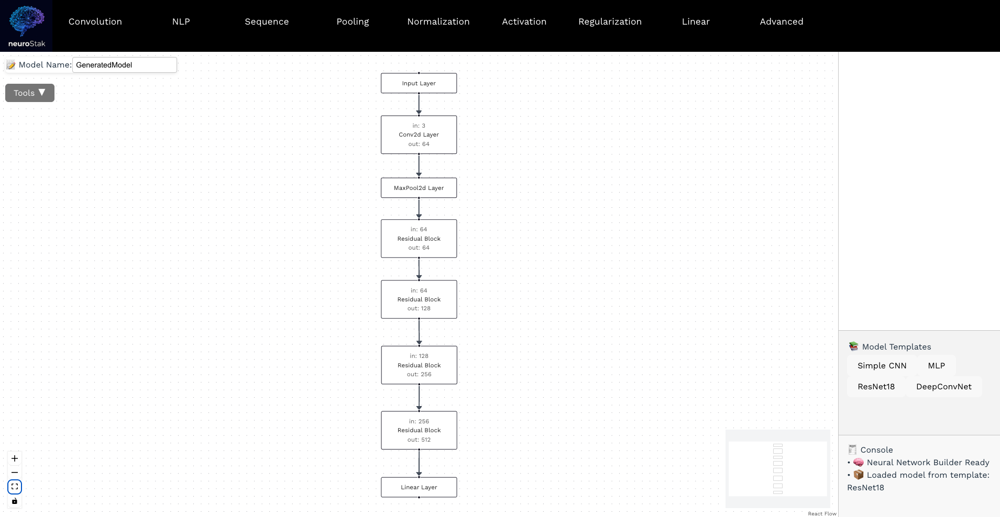

# React + Vite

This template provides a minimal setup to get React working in Vite with HMR and some ESLint rules.

Currently, two official plugins are available:

- [@vitejs/plugin-react](https://github.com/vitejs/vite-plugin-react/blob/main/packages/plugin-react) uses [Babel](https://babeljs.io/) for Fast Refresh
- [@vitejs/plugin-react-swc](https://github.com/vitejs/vite-plugin-react/blob/main/packages/plugin-react-swc) uses [SWC](https://swc.rs/) for Fast Refresh

## Expanding the ESLint configuration

If you are developing a production application, we recommend using TypeScript with type-aware lint rules enabled. Check out the [TS template](https://github.com/vitejs/vite/tree/main/packages/create-vite/template-react-ts) for information on how to integrate TypeScript and [`typescript-eslint`](https://typescript-eslint.io) in your project.

# 🧱 neuroStak

A visual neural network builder built with React and React Flow, designed to let users create custom deep learning architectures using drag-and-drop building blocks. Easily export to PyTorch, SVG, PDF, or JSON.

## ✨ Features

- ✅ Drag-and-drop neural layers to design your model
- ✅ Visualize tensor dimensions and skip connections
- ✅ Prebuilt templates (e.g., ResNet18, DeepConvNet)
- ✅ Export to:
  - PyTorch code (.py) 
  - JSON
  - SVG image
  - PDF document
- ✅ Undo/Redo, Save/Load
- ✅ Intuitive UI with category-based layer navbar

## 📸 Screenshots



## 🚀 Getting Started

### 1. Clone the repo

```bash
git clone https://github.com/luanch2016/neuroStak.git
cd neuroStak
```

### 2. Install dependencies

```bash
npm install
```

### 3. Run locally

```bash
npm run dev
```

The app will be available at [http://localhost:5173](http://localhost:5173)

Live Page: https://neuro-stak-8ou9.vercel.app/

## 📁 Folder Structure

```
frontend/
├── public/
├── src/
│   ├── components/
│   ├── utils/
│   ├── assets/
│   ├── App.jsx
│   ├── App.css
│   └── flowConfig.js
```

## 🧠 Supported Layer Types

- **Convolution:** `Conv2d`, `ConvTranspose2d`, `DepthwiseConv2d`, `SeparableConv2d`
- **Pooling:** `MaxPool2d`, `AvgPool2d`, `GlobalAvgPool2d`, `AdaptiveAvgPool2d`
- **Normalization:** `BatchNorm`, `GroupNorm`, `InstanceNorm2d`, `LayerNorm`
- **Activation:** `ReLU`, `LeakyReLU`, `PReLU`, `ELU`, `GELU`, `Tanh`, `Sigmoid`, `Softmax`
- **Regularization:** `Dropout`, `Dropout2d`
- **Utility:** `Flatten`, `Reshape`, `Concat`, `Skip`, `Linear`
- **Recurrent:** `LSTM`, `GRU`, `BiLSTM`, `StackedLSTM`, `LSTMCell`
- **Advanced:** `ResidualBlock`, `SqueezeExcitation`, `Attention`, `PackPaddedSequence`, `PadPackedSequence`, `TimeDistributed`

## 📝 Templates

- `SimpleCNN`
- `ResNet18`
- `DeepConvNet`

## 💾 Export Options

You can export your model as:
- `.py` - PyTorch Code
- `.svg` - Network Diagram
- `.pdf` - Network Diagram
- `.json` - For later editing

## 📜 License

MIT License. See [LICENSE](./LICENSE) for more information.

## 🙌 Acknowledgements

- [React Flow](https://reactflow.dev/)
- [PyTorch](https://pytorch.org/)
- [html-to-image](https://github.com/bubkoo/html-to-image)
- [jsPDF](https://github.com/parallax/jsPDF)


This is my first time making an app this size. Would love to get feedback from you! 

---

Made by luangineer